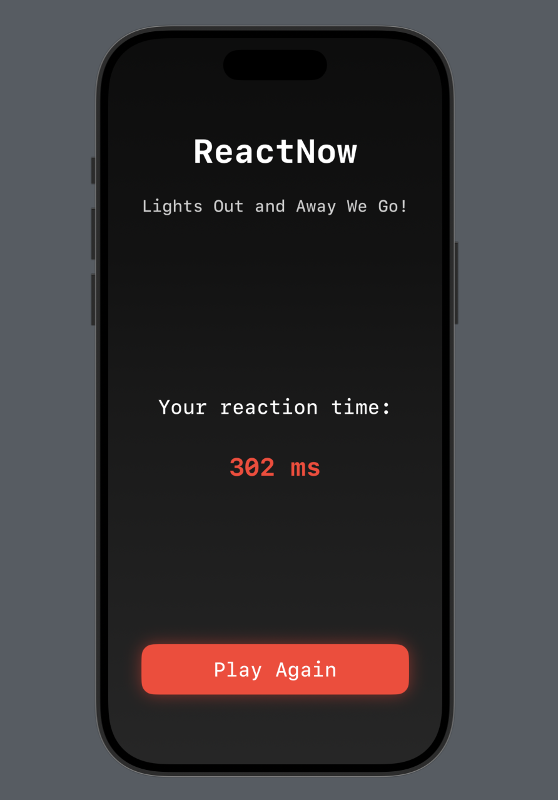

# 🚦 ReactNow

_A modern, Formula 1-inspired reaction timer game built with SwiftUI._

---

## Screenshots

| Start Screen | Signal Lights | Reaction Result |
|:---:|:---:|:---:|
|  |  |  |

---

## Features

- 🏁 F1-style signal light sequence
- ⏱️ Accurate reaction time measurement
- ✨ Smooth animations and transitions
- 📱 Responsive design for all iOS devices
- 🌑 Clean, modern dark UI

---

## Requirements

- iOS 15.0+
- Xcode 13.0+
- Swift 5.5+

---

## Installation

1. **Clone the repository:**
   ```bash
   git clone https://github.com/yourusername/ReactNow.git
   ```
2. **Open the project in Xcode:**
   ```bash
   cd ReactNow
   open ReactNow.xcodeproj
   ```
3. **Build and run the project in Xcode.**

---

## How to Play

1. Tap **Start Now** to begin.
2. Watch the F1-style signal lights sequence.
3. When all lights turn off, tap the screen as quickly as possible.
4. Your reaction time will be displayed.
5. Tap **Play Again** to try again!

---

## License

This project is available under the MIT license. See the [LICENSE](LICENSE) file for more info.

---

<div align="center">
  <strong>Made with ❤️ by Sarvagna</strong>
</div> 
